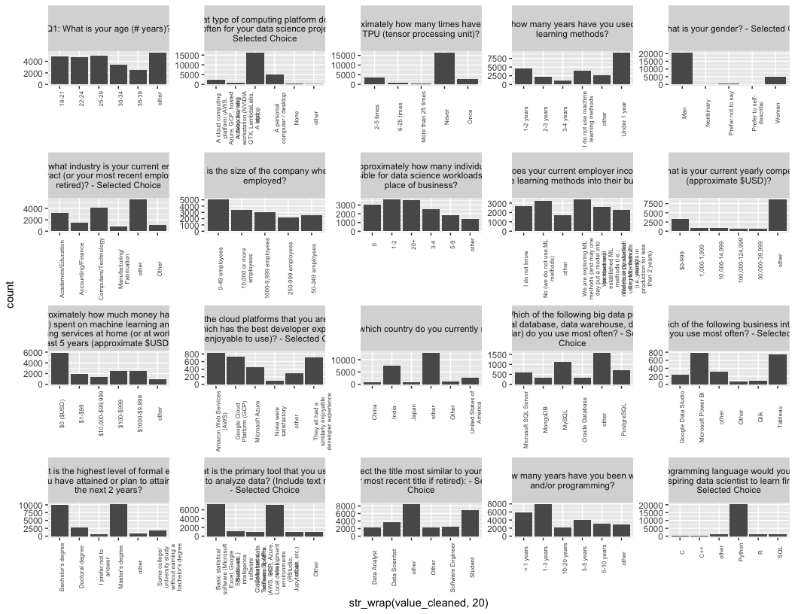

Kaggle ML/DS Survey: Exploratory Data Analysis (with R)
================

### Setup

To get raw data, first run these scripts: `src/get_data.py`,
`src/parse_questions.py` - outputs the CSV files referenced below

### Get Initial Data

``` r
library(tidyverse)
```

    ## ── Attaching packages ─────────────────────────────────────── tidyverse 1.3.1 ──

    ## ✓ ggplot2 3.3.5     ✓ purrr   0.3.4
    ## ✓ tibble  3.1.5     ✓ dplyr   1.0.7
    ## ✓ tidyr   1.1.3     ✓ stringr 1.4.0
    ## ✓ readr   2.0.1     ✓ forcats 0.5.1

    ## ── Conflicts ────────────────────────────────────────── tidyverse_conflicts() ──
    ## x dplyr::filter() masks stats::filter()
    ## x dplyr::lag()    masks stats::lag()

``` r
questions <- read_csv("../data/interim/questions.csv", col_types = "c") %>%
  mutate(question_key = if_else(question_key == "Time from Start to Finish (seconds)", "duration_sec", question_key),
         id = as.integer(id)
  ) %>%
  rename(question_id = id, question_id_sub = id_sub, question_part = part, question_description = description)
head(questions)
```

    ## # A tibble: 6 × 5
    ##   question_key question_id question_id_sub question_part question_description   
    ##   <chr>              <int> <chr>           <chr>         <chr>                  
    ## 1 duration_sec          NA <NA>            <NA>          Duration (in seconds)  
    ## 2 Q1                     1 <NA>            <NA>          What is your age (# ye…
    ## 3 Q2                     2 <NA>            <NA>          What is your gender? -…
    ## 4 Q3                     3 <NA>            <NA>          In which country do yo…
    ## 5 Q4                     4 <NA>            <NA>          What is the highest le…
    ## 6 Q5                     5 <NA>            <NA>          Select the title most …

``` r
responses_raw <- read_csv("../data/interim/kaggle_survey_2021_responses.csv", col_types = "c")
head(responses_raw)
```

    ## # A tibble: 6 × 369
    ##   `Time from Start … Q1    Q2    Q3     Q4      Q5     Q6    Q7_Part_1 Q7_Part_2
    ##   <chr>              <chr> <chr> <chr>  <chr>   <chr>  <chr> <chr>     <chr>    
    ## 1 910                50-54 Man   India  Bachel… Other  5-10… Python    R        
    ## 2 784                50-54 Man   Indon… Master… Progr… 20+ … <NA>      <NA>     
    ## 3 924                22-24 Man   Pakis… Master… Softw… 1-3 … Python    <NA>     
    ## 4 575                45-49 Man   Mexico Doctor… Resea… 20+ … Python    <NA>     
    ## 5 781                45-49 Man   India  Doctor… Other  < 1 … Python    <NA>     
    ## 6 1020               25-29 Woman India  I pref… Curre… < 1 … Python    <NA>     
    ## # … with 360 more variables: Q7_Part_3 <chr>, Q7_Part_4 <chr>, Q7_Part_5 <chr>,
    ## #   Q7_Part_6 <chr>, Q7_Part_7 <chr>, Q7_Part_8 <chr>, Q7_Part_9 <chr>,
    ## #   Q7_Part_10 <chr>, Q7_Part_11 <chr>, Q7_Part_12 <chr>, Q7_OTHER <chr>,
    ## #   Q8 <chr>, Q9_Part_1 <chr>, Q9_Part_2 <chr>, Q9_Part_3 <chr>,
    ## #   Q9_Part_4 <chr>, Q9_Part_5 <chr>, Q9_Part_6 <chr>, Q9_Part_7 <chr>,
    ## #   Q9_Part_8 <chr>, Q9_Part_9 <chr>, Q9_Part_10 <chr>, Q9_Part_11 <chr>,
    ## #   Q9_Part_12 <chr>, Q9_OTHER <chr>, Q10_Part_1 <chr>, Q10_Part_2 <chr>, …

``` r
responses <- responses_raw %>%
  mutate(response_id = row_number()) %>%
  rename(duration_sec = `Time from Start to Finish (seconds)`)
head(responses)
```

    ## # A tibble: 6 × 370
    ##   duration_sec Q1    Q2    Q3    Q4    Q5    Q6    Q7_Part_1 Q7_Part_2 Q7_Part_3
    ##   <chr>        <chr> <chr> <chr> <chr> <chr> <chr> <chr>     <chr>     <chr>    
    ## 1 910          50-54 Man   India Bach… Other 5-10… Python    R         <NA>     
    ## 2 784          50-54 Man   Indo… Mast… Prog… 20+ … <NA>      <NA>      SQL      
    ## 3 924          22-24 Man   Paki… Mast… Soft… 1-3 … Python    <NA>      <NA>     
    ## 4 575          45-49 Man   Mexi… Doct… Rese… 20+ … Python    <NA>      <NA>     
    ## 5 781          45-49 Man   India Doct… Other < 1 … Python    <NA>      <NA>     
    ## 6 1020         25-29 Woman India I pr… Curr… < 1 … Python    <NA>      <NA>     
    ## # … with 360 more variables: Q7_Part_4 <chr>, Q7_Part_5 <chr>, Q7_Part_6 <chr>,
    ## #   Q7_Part_7 <chr>, Q7_Part_8 <chr>, Q7_Part_9 <chr>, Q7_Part_10 <chr>,
    ## #   Q7_Part_11 <chr>, Q7_Part_12 <chr>, Q7_OTHER <chr>, Q8 <chr>,
    ## #   Q9_Part_1 <chr>, Q9_Part_2 <chr>, Q9_Part_3 <chr>, Q9_Part_4 <chr>,
    ## #   Q9_Part_5 <chr>, Q9_Part_6 <chr>, Q9_Part_7 <chr>, Q9_Part_8 <chr>,
    ## #   Q9_Part_9 <chr>, Q9_Part_10 <chr>, Q9_Part_11 <chr>, Q9_Part_12 <chr>,
    ## #   Q9_OTHER <chr>, Q10_Part_1 <chr>, Q10_Part_2 <chr>, Q10_Part_3 <chr>, …

``` r
responses_long <- left_join(
  questions,
  responses %>%
    pivot_longer(names_to = "question_key", cols = duration_sec:Q38_B_OTHER) %>%
    filter(!is.na(value)),
  by = "question_key"
)
glimpse(responses_long)
```

    ## Rows: 1,255,751
    ## Columns: 7
    ## $ question_key         <chr> "duration_sec", "duration_sec", "duration_sec", "…
    ## $ question_id          <int> NA, NA, NA, NA, NA, NA, NA, NA, NA, NA, NA, NA, N…
    ## $ question_id_sub      <chr> NA, NA, NA, NA, NA, NA, NA, NA, NA, NA, NA, NA, N…
    ## $ question_part        <chr> NA, NA, NA, NA, NA, NA, NA, NA, NA, NA, NA, NA, N…
    ## $ question_description <chr> "Duration (in seconds)", "Duration (in seconds)",…
    ## $ response_id          <int> 1, 2, 3, 4, 5, 6, 7, 8, 9, 10, 11, 12, 13, 14, 15…
    ## $ value                <chr> "910", "784", "924", "575", "781", "1020", "141",…

``` r
salary <- responses_long %>%
  filter(question_id == 25) %>%
  mutate(salary_lower = as.integer(str_extract(str_replace_all(value, "[>$,]", ""), "^\\d+"))) %>%
  mutate(salary = factor(salary_lower, ordered = TRUE, labels = unique(value[order(salary_lower)])))
glimpse(salary)
```

    ## Rows: 15,391
    ## Columns: 9
    ## $ question_key         <chr> "Q25", "Q25", "Q25", "Q25", "Q25", "Q25", "Q25", …
    ## $ question_id          <int> 25, 25, 25, 25, 25, 25, 25, 25, 25, 25, 25, 25, 2…
    ## $ question_id_sub      <chr> NA, NA, NA, NA, NA, NA, NA, NA, NA, NA, NA, NA, N…
    ## $ question_part        <chr> NA, NA, NA, NA, NA, NA, NA, NA, NA, NA, NA, NA, N…
    ## $ question_description <chr> "What is your current yearly compensation (approx…
    ## $ response_id          <int> 1, 2, 3, 4, 5, 8, 10, 11, 14, 15, 16, 17, 18, 20,…
    ## $ value                <chr> "25,000-29,999", "60,000-69,999", "$0-999", "30,0…
    ## $ salary_lower         <int> 25000, 60000, 0, 30000, 30000, 15000, 0, 70000, 2…
    ## $ salary               <ord> "25,000-29,999", "60,000-69,999", "$0-999", "30,0…

### More Exploration

Need to clean up the plot, but saving as is for now

``` r
response_summary <- responses %>%
  select(-duration_sec) %>%
  pivot_longer(names_to = "question_key", cols = Q1:Q38_B_OTHER) %>%
  filter(!is.na(value)) %>%
  group_by(question_key, value) %>%
  summarise(count = n(), .groups = "drop") %>%
  group_by(question_key) %>%
  mutate(pct = count / sum(count)) %>%
  ungroup()
head(response_summary)
```

    ## # A tibble: 6 × 4
    ##   question_key value count    pct
    ##   <chr>        <chr> <int>  <dbl>
    ## 1 Q1           18-21  4901 0.189 
    ## 2 Q1           22-24  4694 0.181 
    ## 3 Q1           25-29  4931 0.190 
    ## 4 Q1           30-34  3441 0.132 
    ## 5 Q1           35-39  2504 0.0964
    ## 6 Q1           40-44  1890 0.0728

``` r
response_summary_top5 <- response_summary %>%
  group_by(question_key) %>%
  mutate(top_5_flag = count %in% sort(unique(count), decreasing = TRUE)[1:5]) %>%
  ungroup() %>%
  mutate(value_cleaned = if_else(top_5_flag, value, "other"))
head(response_summary_top5)
```

    ## # A tibble: 6 × 6
    ##   question_key value count    pct top_5_flag value_cleaned
    ##   <chr>        <chr> <int>  <dbl> <lgl>      <chr>        
    ## 1 Q1           18-21  4901 0.189  TRUE       18-21        
    ## 2 Q1           22-24  4694 0.181  TRUE       22-24        
    ## 3 Q1           25-29  4931 0.190  TRUE       25-29        
    ## 4 Q1           30-34  3441 0.132  TRUE       30-34        
    ## 5 Q1           35-39  2504 0.0964 TRUE       35-39        
    ## 6 Q1           40-44  1890 0.0728 FALSE      other

``` r
response_summary_top5 %>%
  filter(!str_detect(question_key, "Part|OTHER")) %>%
  ggplot() +
  geom_bar(aes(value_cleaned, count), stat = "identity") +
  facet_wrap(~question_key, scales = "free")
```

<!-- -->
